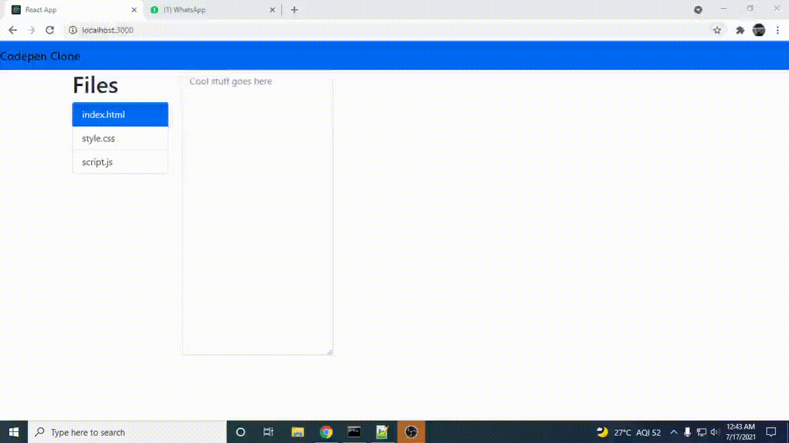

# React basic

[Azure Static Web Apps](https://docs.microsoft.com/azure/static-web-apps/overview) allows you to easily build [React](https://reactjs.org/) apps in minutes. Use this repo with the [React quickstart](https://docs.microsoft.com/azure/static-web-apps/getting-started?tabs=react) to build and customize a new static site.

This project was bootstrapped with [Create React App](https://github.com/facebook/create-react-app).
# Codepen Clone using ReactJS 
##Have a look at it!
[Demo Link](https://delightful-island-046dbb810.1.azurestaticapps.net)

